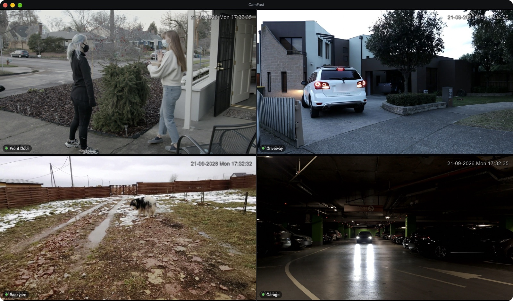
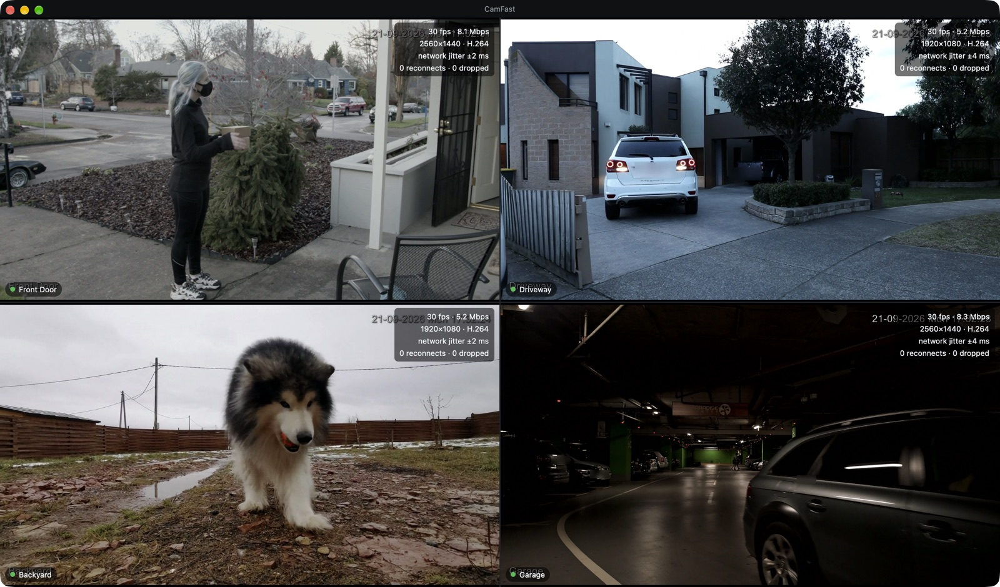
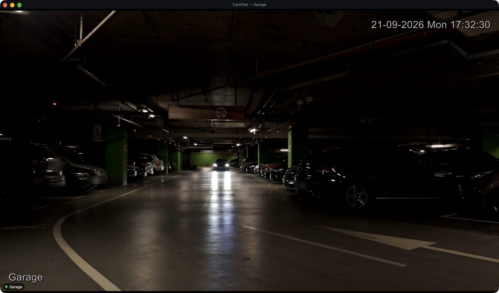
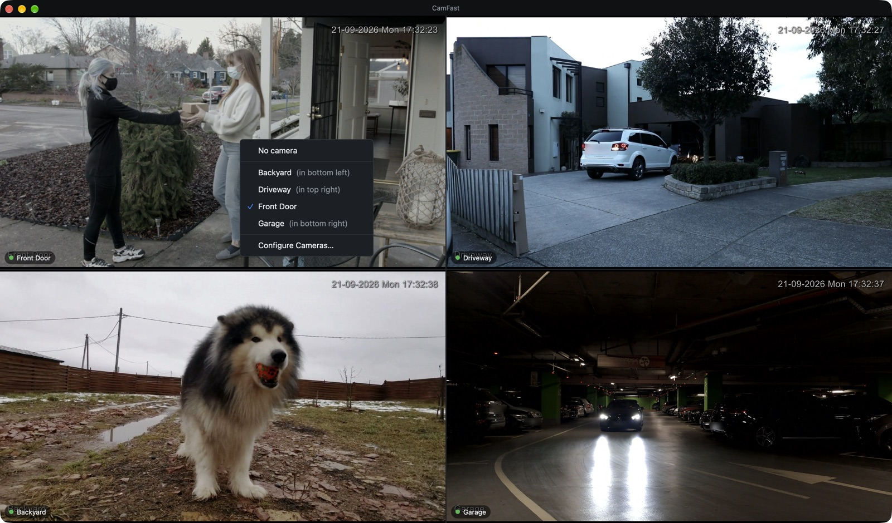
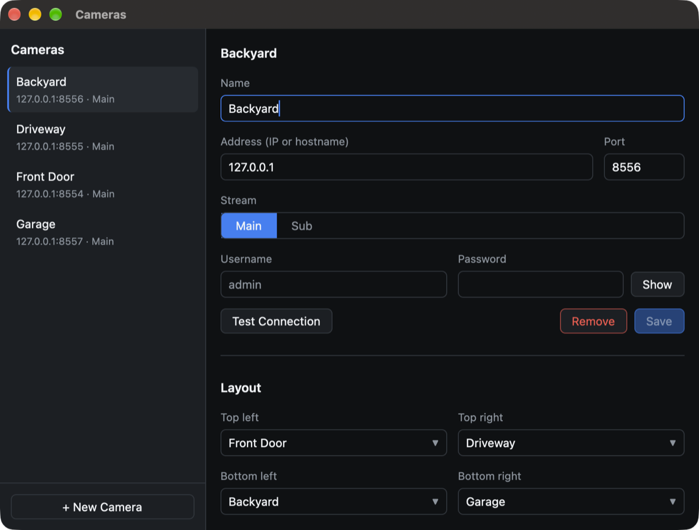

# CamFast

A tiny, fast, native macOS viewer for your IP cameras. It shows a live 2×2 mosaic of RTSP
streams, decoded by the hardware video engine and drawn by the GPU, so the CPU barely notices.

Built with Rust and [GPUI](https://www.gpui.rs). No recording, no cloud, no accounts:
it only shows live video, and it's built to keep showing it.

**[Download the latest release](https://github.com/christiancuri/camfast/releases/latest)**
(macOS 13+, Apple silicon)



## Highlights

- **Hardware all the way down.** RTSP ([retina](https://github.com/scottlamb/retina)) →
  VideoToolbox hardware decode → IOSurface → Metal. Decoded frames never touch the CPU and are
  never copied.
- **Light.** Three live cameras (2× 2560×1440 @ 30 fps + 1× 1080p @ 30 fps) use about 5% of one
  CPU core and ~90 MB of RAM on an Apple M5.
- **Stays up.** Each camera has its own supervisor with connect/read timeouts, a "no frames"
  watchdog, exponential backoff with jitter, clean RTSP teardown and recovery on the next
  keyframe. One camera failing never affects the others.
- **Knows when to rest.** When the window is hidden it stops decoding after 2 s and disconnects
  after 5 min. It resumes instantly when you look again, and reconnects cleanly after sleep.
- **Careful with your cameras.** Authentication failures are never retried in a loop (many
  cameras lock the account after a few wrong passwords), and CamFast keeps at most one session
  per camera.
- **Smooth playback (optional).** Plays frames at the camera's own pace to absorb Wi-Fi jitter,
  at the cost of ~150 ms of latency.

## Screenshots

| Statistics (⌘I) | Focus on one camera (double-click) |
|---|---|
|  |  |

| Pick a camera per tile (right-click) | Camera settings (⌘,) |
|---|---|
|  |  |

The screenshots use the [demo cameras](scripts/demo/README.md), which stream free stock
footage ([credits](scripts/demo/CREDITS.md)).

## Requirements

- macOS 13 or later on Apple silicon (M1 or newer).
- IP cameras that serve H.264 or H.265 over RTSP on the Dahua-style path
  `rtsp://HOST:PORT/cam/realmonitor?channel=1&subtype=0`. Dahua and Intelbras cameras use this
  path; CamFast was built against Intelbras VIP 1430 D G2 and VIP 1230 B G5.

## Install

Download `CamFast-<version>.dmg` from the
[latest release](https://github.com/christiancuri/camfast/releases/latest), open it and drag
**CamFast** to Applications. Each release also lists the DMG's SHA-256 checksum. To build the
DMG yourself, see [Building](#building).

CamFast is ad-hoc signed, not notarized. On first launch, macOS will block it: open
**System Settings › Privacy & Security** and click **Open Anyway**, or run:

```sh
xattr -dr com.apple.quarantine /Applications/CamFast.app
```

When macOS asks for **Local Network** access, allow it. Without it the app can't reach your
cameras.

## Usage

1. The **Cameras** window opens on first launch. Add each camera (name, IP, port, main or sub
   stream, username and password), click **Test Connection**, then **Save**.
2. Under **Layout**, choose the camera for each tile. You can also right-click a tile.
3. Turn on **Open at login** in Preferences if the Mac is a dedicated monitoring station.

| Shortcut | Action |
|---|---|
| Double-click a tile | Expand it / back to the mosaic |
| Esc | Back to the mosaic |
| Right-click a tile | Choose its camera, reconnect now |
| ⌘, | Cameras window |
| ⌘I | Show statistics |

The configuration lives in `~/Library/Application Support/camfast/config.toml` with mode 0600,
and logs go to `~/Library/Logs/camfast/`. Passwords are never written to logs.

### Tips for the cameras

- Use H.264 or H.265, with a keyframe interval of 1–2 s (a GOP of 30–60 at 30 fps). Short GOPs
  get the picture back quickly after a reconnect.
- Turn off "smart codec" / H.265+ modes. Their very long GOPs delay the first image for several
  seconds.
- Prefer a wired Mac: Wi-Fi jitter makes 1440p streams arrive in bursts. The **Smooth playback**
  preference hides most of it if you can't use a cable.

## How it works

```
                 per camera                                        shared
┌─────────────────────────────────┐  ┌────────────────────────┐   ┌───────────────────────┐
│ RTSP supervisor (tokio)         │  │ Decode thread          │   │ GPUI (main thread)    │
│ retina, TCP interleaved         │─▶│ VTDecompressionSession │──▶│ Tile ─ gpui::surface  │
│ timeouts · watchdog · backoff   │  │ NV12 '420f' IOSurface  │   │ Metal, zero-copy      │
└─────────────────────────────────┘  └────────────────────────┘   └───────────────────────┘
      AUs (bounded queue, 2 s)          latest-frame slot + coalesced repaint signal
```

The workspace has four crates:

| Crate | Role |
|---|---|
| `camfast` (root) | GPUI app: mosaic, tiles, Cameras window, menus, window state |
| `crates/cam_stream` | RTSP sessions, VideoToolbox decoding, supervision, pacing, statistics |
| `crates/cam_config` | TOML configuration: atomic writes, 0600 permissions, validation |
| `crates/cam_platform` | macOS integration: sleep/wake, App Nap, open at login |

## Building

You need Xcode with the Metal Toolchain (`xcodebuild -downloadComponent MetalToolchain`) and a
recent stable Rust.

```sh
cargo run --release                 # run from source
packaging/macos/bundle.sh --install # build CamFast.app and copy it to /Applications
packaging/macos/dmg.sh              # build dist/CamFast-<version>.dmg
```

### Tests

```sh
cargo test --workspace
# Integration tests against local RTSP servers (needs `brew install mediamtx ffmpeg`):
cargo test -p cam_stream --test mediamtx -- --ignored --test-threads=1
```

To try CamFast without real cameras, or to reproduce the screenshots, use the demo cameras:

```sh
scripts/demo/fetch.sh && scripts/demo/run.sh
CAMFAST_CONFIG="$HOME/.cache/camfast-demo/run/config.toml" cargo run --release
scripts/demo/stop.sh
```

A headless probe runs the whole pipeline without the UI:

```sh
CAM_USER=admin CAM_PASS=secret cargo run --release -p cam_stream --example probe -- 192.168.1.10 30
```

## Acknowledgements

- [GPUI](https://www.gpui.rs) by the Zed team
- [retina](https://github.com/scottlamb/retina) by Scott Lamb
- The [objc2](https://github.com/madsmtm/objc2) bindings
- Inspired by [zapfast](https://github.com/crmne/zapfast) and
  [spotifast](https://github.com/crmne/spotifast)

## License

[MIT](LICENSE)
